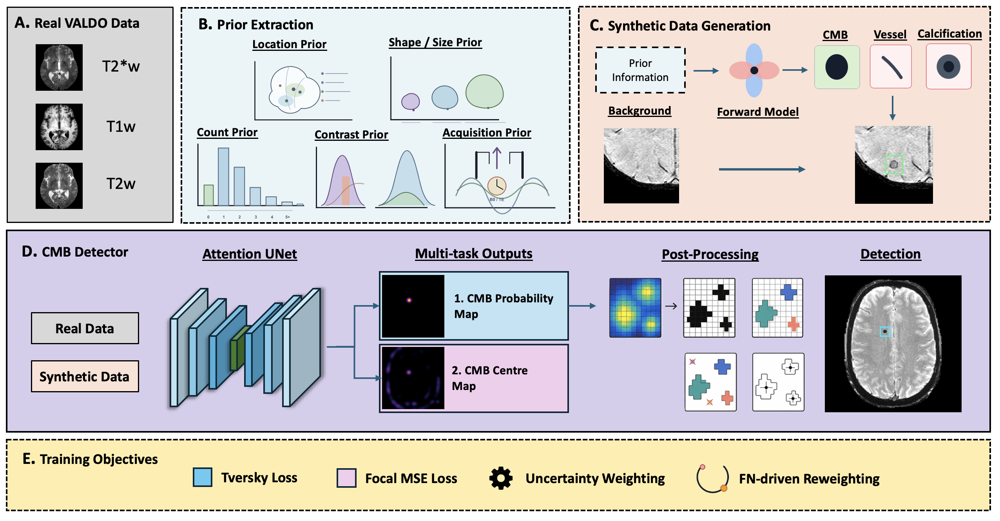

<div align="center">

# CenSynCMB

### Centre Maps and Physics-Guided Synthesis for Microbleed Detection

**Accepted as a Regular / Full Paper · IEEE BIBM 2026**

[](LICENSE)
[](#installation)
[](#installation)
[](#installation)

[Overview](#overview) · [Quick start](#quick-start) · [Pretrained weights](#pretrained-weights) · [Input preparation](#input-preparation) · [Citation](#citation)



<sub>Architecture figure from the authors' manuscript. Synthesis and auxiliary supervision belong to training; the released inference pipeline produces CMB probability maps, candidate masks and lesion centroids.</sub>

</div>

## Overview

CenSynCMB detects cerebral microbleed (CMB) candidates in susceptibility-sensitive MRI. The paper combines a **3D Attention U-Net**, **auxiliary centre-map supervision**, **false-negative-driven reweighting**, and **physics-guided synthesis of CMBs and common mimics**.

This repository provides the **inference implementation for the supplied pretrained checkpoint**:

| Input | Processing | Output |
| :--- | :--- | :--- |
| T2*/SWI, with optional co-registered T1 and T2 | RAS orientation → 1 mm resampling → intensity normalisation → sliding-window prediction | Probability map, 26-connected candidate mask, lesion centroids and run metadata |

Single-subject and JSON batch inputs are supported, with CUDA or CPU execution.

> **Release scope:** this is an inference release. Training, synthesis, cross-validation splits and the full evaluation pipeline are not included. The paper's complete experiments cannot be reproduced from this repository alone.

## Quick start

Run the following from a terminal with Python 3.11 available:

```bash
git clone https://github.com/LucasHe17/CenSynCMB_Microbleed.git
cd CenSynCMB_Microbleed

python3.11 -m venv .venv
source .venv/bin/activate
python -m pip install --upgrade pip
python -m pip install -r requirements.txt

# Download the separately published checkpoint and verify its SHA-256.
python scripts/download_weights.py

# Replace the image path with your own 3D NIfTI.
python scripts/run_inference.py \
  --t2s /path/to/subject001_swi.nii.gz \
  --sid subject001 \
  --output-dir outputs/subject001
```

**Weight availability:** the download command requires the `v1.0.0` asset on [GitHub Releases](https://github.com/LucasHe17/CenSynCMB_Microbleed/releases). Until that asset is published, it reports that the checkpoint is unavailable. Cloning the repository downloads the code and documentation only.

## Installation

The validation environment used **Python 3.11, PyTorch 2.6.0 and MONAI 1.5.0**. Install the remaining dependencies with `requirements.txt`; exact tested versions and the validation boundary are recorded in [Validation](docs/VALIDATION.md).

For NVIDIA GPU inference, install the appropriate PyTorch 2.6 build for your driver and platform using the [official PyTorch instructions](https://pytorch.org/get-started/previous-versions/). Confirm the selected environment before a large run:

```bash
python -c "import torch; print(torch.__version__); print('CUDA available:', torch.cuda.is_available())"
python scripts/run_inference.py --help
```

The default `--device auto` uses CUDA when available and otherwise CPU. CPU execution was checked on a small synthetic volume; full-volume runtime and GPU memory requirements depend on the scan and window size. On a cluster, run full-volume inference inside an allocated compute job.

## Pretrained weights

The release checkpoint contains **23,627,747 model parameters** and inference configuration. Optimizer state and training-machine paths have been removed; every model tensor was checked for exact equality with the supplied original.

| Release asset | Purpose |
| :--- | :--- |
| `censyncmb_v1.0.0.pth` | Inference checkpoint, 94,599,306 bytes (about 95 MB) |
| `censyncmb_v1.0.0.sha256` | File integrity checksum |
| `censyncmb_v1.0.0.json` | Model configuration and export metadata |

`scripts/download_weights.py` reads [weights/manifest.json](weights/manifest.json), checks the download's size and SHA-256, and installs it into `weights/`. An existing valid file is reused; a mismatched file is rejected.

You can also download the checkpoint manually from Releases, put it at `weights/censyncmb_v1.0.0.pth`, then run the download command to verify it. To use a checkpoint stored elsewhere, pass `--checkpoint /path/to/model.pth`.

Maintainers: see [Publishing weights](docs/RELEASING.md) for browser and command-line upload instructions.

## Input preparation

| Argument / JSON key | Required | Expected data |
| :--- | :---: | :--- |
| `t2s` | Yes | A 3D T2*-weighted or SWI NIfTI image (`.nii` or `.nii.gz`) |
| `t1` | No | T1 image already co-registered and resampled onto the T2*/SWI grid |
| `t2` | No | T2 image already co-registered and resampled onto the T2*/SWI grid |
| `sid` | Recommended | Unique subject ID, such as `subject001` |

- Supply images with correct spatial affines expressed in **millimetres**.
- Supplied modalities must have the same shape and affine. The script checks their grids; anatomical registration must be completed beforehand.
- Omitted T1/T2 channels are zero-filled. An explicitly supplied path that does not exist raises an error.
- IDs must begin with a letter or digit and contain only letters, digits, `_`, `-` or `.`. Duplicate IDs in a batch are rejected.
- Each modality is reoriented to RAS, resampled to 1 mm isotropic spacing, scaled using the 1st–99th percentiles, and normalised over nonzero voxels. The model channel order is **T2*/SWI, T1, T2**.

No participant images or annotations are distributed here.

## Usage

### One subject with all three modalities

```bash
python scripts/run_inference.py \
  --checkpoint weights/censyncmb_v1.0.0.pth \
  --sid subject001 \
  --t2s /path/to/subject001_t2s.nii.gz \
  --t1 /path/to/subject001_t1_in_t2s_space.nii.gz \
  --t2 /path/to/subject001_t2_in_t2s_space.nii.gz \
  --device cuda \
  --output-dir outputs/subject001
```

For SWI-only inference, omit `--t1` and `--t2`. Select `--device cpu` to run without CUDA.

### A batch of subjects

Create a JSON file using [examples/manifest.json](examples/manifest.json) as a template:

```json
[
  {
    "sid": "subject001",
    "t2s": "../data/subject001_swi.nii.gz"
  },
  {
    "sid": "subject002",
    "t2s": "../data/subject002_t2s.nii.gz",
    "t1": "../data/subject002_t1_in_t2s_space.nii.gz",
    "t2": "../data/subject002_t2_in_t2s_space.nii.gz"
  }
]
```

Relative image paths are resolved from the **manifest's directory**. Absolute paths are also accepted. Replace the example paths with your own before running:

```bash
python scripts/run_inference.py \
  --manifest examples/manifest.json \
  --output-dir outputs/batch
```

### Inference controls

| Option | Default | Effect |
| :--- | :--- | :--- |
| `--threshold` | `0.5` | Probability threshold for the binary mask |
| `--min-pred-voxels` | `5` | Discard 26-connected components smaller than this voxel count |
| `--device` | `auto` | `auto`, `cuda` or `cpu` |
| `--roi-size` | `128,128,128` from the checkpoint | Sliding-window size; each dimension must be a positive multiple of 16 |
| `--sw-batch-size` | `1` from the checkpoint | Number of windows processed together |
| `--sw-overlap` | `0.6` from the checkpoint | Fractional overlap between windows |
| `--no-amp` | Unset | Disable CUDA mixed precision |

If GPU memory is insufficient, keep `--sw-batch-size 1` and consider a smaller ROI, for example `--roi-size 96,96,96`. Changing the ROI, overlap, precision or threshold may change predictions; record the settings used for evaluation.

## Outputs

A run with `--sid subject001 --threshold 0.5` writes:

```text
outputs/subject001/
├── subject001_censyncmb_prob.nii.gz
├── subject001_censyncmb_mask_thr0p5.nii.gz
├── subject001_censyncmb_centroids.csv
└── censyncmb_inference_summary.json
```

- **Probability map:** float32 foreground probabilities.
- **Candidate mask:** uint8 mask after thresholding and small-component removal.
- **Centroids CSV:** one row per 26-connected lesion, with voxel count, zero-based model-grid coordinates `i, j, k`, and physical RAS coordinates `x_ras_mm, y_ras_mm, z_ras_mm`. Empty predictions produce a header-only CSV.
- **Summary JSON:** subject paths, output paths, missing modalities, lesion counts, output affine and key inference settings.

The NIfTI files use the **resampled RAS, 1 mm model grid**, with its spatial affine preserved. They are not written back to the native voxel grid. Use a spatially aware viewer for overlays; resample a binary mask with nearest-neighbour interpolation if native-grid comparison is required. Choose a new output directory for each experiment to avoid replacing earlier files.

## Results reported in the paper

The following are lesion-level **macro means from the manuscript**, not measurements from the software validation:

| Cohort | Recall (%) | Precision (%) | F1 (%) |
| :--- | ---: | ---: | ---: |
| VALDO Task 2 | 75.3 | 79.3 | 74.3 |
| AIBL SWI, external | 88.5 | 55.9 | 65.0 |

See the paper for confidence intervals, cohort definitions and the fold-wise evaluation protocol. This release supplies a single checkpoint and does not reproduce the full five-fold analysis. Candidate detection and patient-level burden estimation require separate evaluation; the manuscript identifies false-positive accumulation and cohort-specific calibration as limitations.

## Validation

Run the lightweight regression suite after installing dependencies:

```bash
python -m unittest discover -s tests -v
```

The real-checkpoint test is skipped unless `CENSYNCMB_CHECKPOINT` is set. To include it:

```bash
OMP_NUM_THREADS=1 OPENBLAS_NUM_THREADS=1 \
CENSYNCMB_CHECKPOINT="$PWD/weights/censyncmb_v1.0.0.pth" \
python -m unittest discover -s tests -v
```

The suite covers spatial metadata preservation, component connectivity, centroid coordinates, input validation and download integrity. [Validation notes](docs/VALIDATION.md) describe what was checked and what remains unverified.

## Citation

If this work contributes to your research, please cite the paper. The proceedings DOI and page numbers will be added when available.

```bibtex
@misc{he2026censyncmb,
  title  = {CenSynCMB: Centre Maps and Physics-Guided Synthesis for Microbleed Detection},
  author = {He, Lucas and Zhang, Hanyuan and Li, Krinos and Saccoh, Adama Fatima
            and Ingala, Silvia and Rehwald, Rafael and de Bruijne, Marleen
            and Barkhof, Frederik and Davies, Rhodri and Sudre, Carole H.},
  year   = {2026},
  note   = {Accepted as a regular/full paper at IEEE BIBM 2026},
  url    = {https://github.com/LucasHe17/CenSynCMB_Microbleed}
}
```

Machine-readable citation metadata is available in [CITATION.cff](CITATION.cff).

## License and acknowledgements

Code is released under the [MIT License](LICENSE). Dependencies retain their respective licenses; dataset access and reuse are governed by the original providers' terms. Weight reuse terms should be stated in the corresponding release.

The architecture image is reproduced from the authors' manuscript. The implementation uses [PyTorch](https://pytorch.org/), [MONAI](https://monai.io/), [NiBabel](https://nipy.org/nibabel/) and [SciPy](https://scipy.org/).

For questions or reproducible bug reports, open an [issue](https://github.com/LucasHe17/CenSynCMB_Microbleed/issues). Use synthetic examples when sharing imaging inputs.
